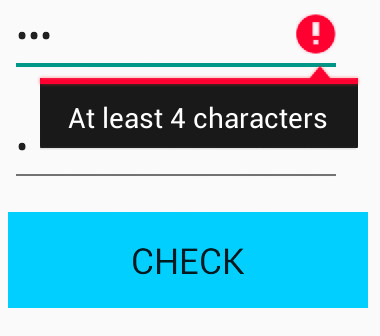
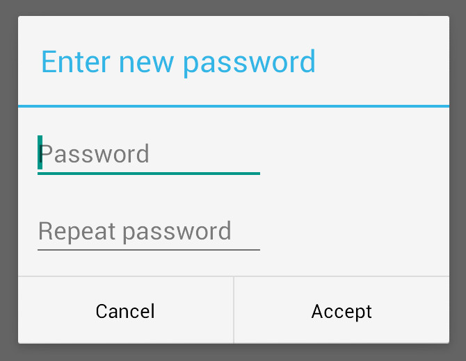

# NewPasswordView
With this small library you will be able to include the common used "new password" view in your app very easily.
Use it directly on your layout or make it easier using it NewPasswordDialog!

There is also a sample showing how it works

### Features
- Passwords check: minimum length and match showing errors if proceed
- Password encryption
- English and spanish translation
- Soft keyboard IME options friendly
- Configurable: minimum lenght and "Check" button visibility

### Getting started

To use it, just include in your layout:
```xml
<com.triskelapps.newpasswordview.NewPasswordView
        android:id="@+id/view_new_pass"
        android:layout_width="match_parent"
        android:layout_height="wrap_content" />
```

Take the reference, or create it directly in java:
```java
viewNewPassword = (NewPasswordView) findViewById(R.id.view_new_pass);
or
NewPasswordView viewNewPassword = new NewPasswordView(context);
```

Then set the callback:

```java
viewNewPassword.setOnPasswordCheckListener(new NewPasswordView.OnPasswordCheckListener() {

    @Override
    public void onPasswordCorrect(String password) {
                
    }

    @Override
    public void onPasswordError(String reason) {

    }
});
```


Optionally, some configurations:
```java

viewNewPassword.digestPassword("SHA-1");
viewNewPassword.setMinimumLength(4);
```

Also you can handle Check action by yourself:
```java
viewNewPassword.setButtonCheckVisible(false);
...
viewNewPassword.performButtonCheckClick();
```

#### DIALOG
To simplify even more this functionality, use a Dialog!:

```java
NewPasswordDialog dialog = NewPasswordDialog.newInstance();
        dialog.configure(getString(R.string.enter_new_password), new NewPasswordDialog.NewPasswordDialogListener() {
            @Override
            public void onAccept(String text) {

                // User clicked dialog Ok and password is correct, so do what you want with it! 
            }
        });

        dialog.show(getSupportFragmentManager(), null);
```


#### Want to test it by yourself? 

### Enjoy!
